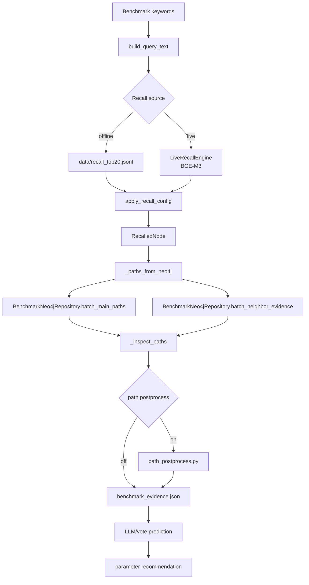
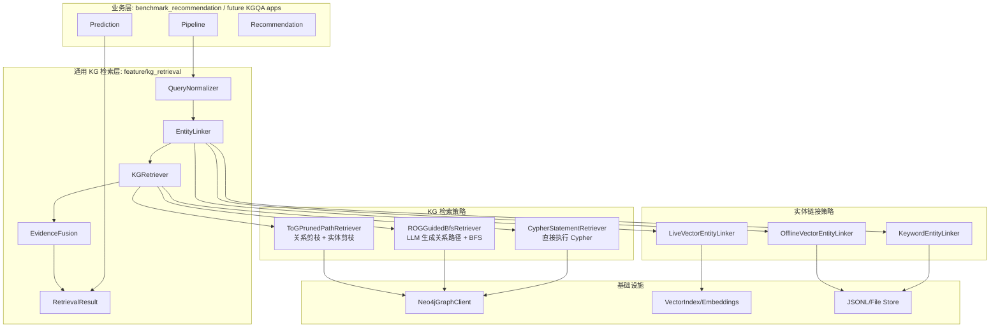
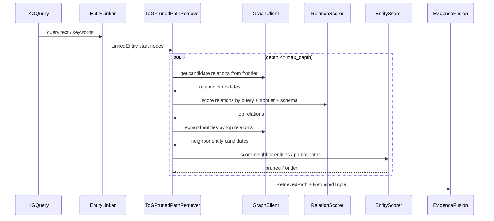
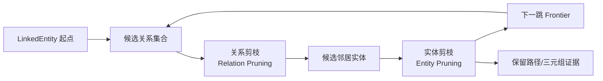
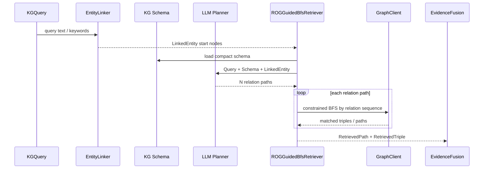
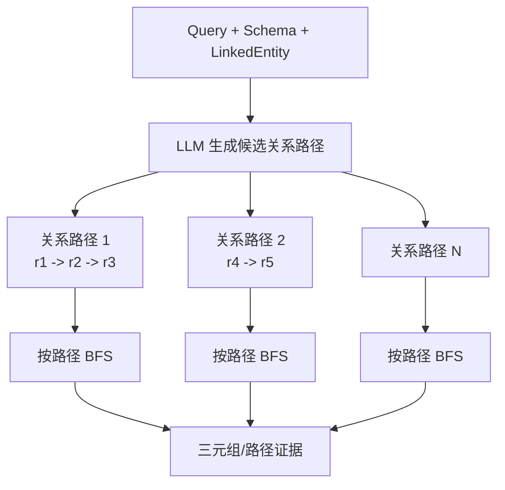
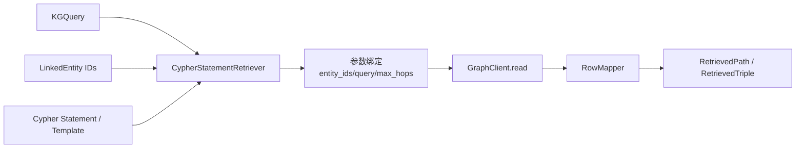
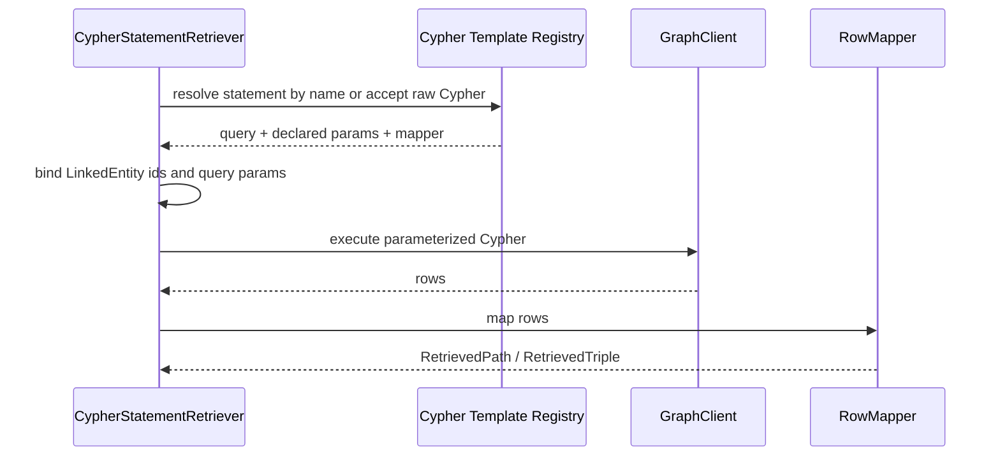
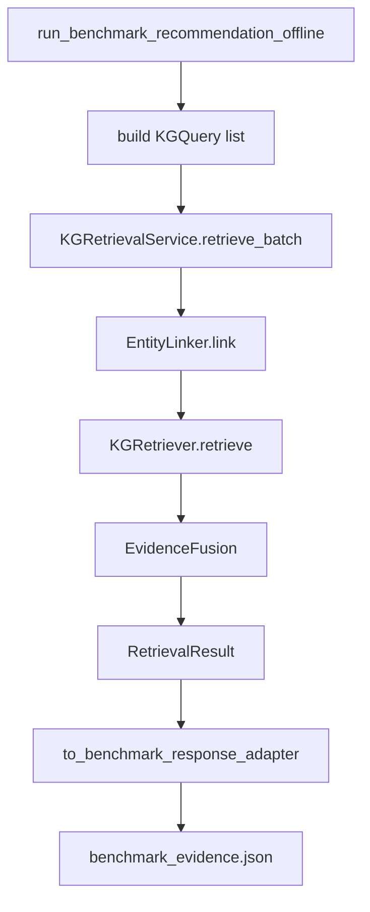
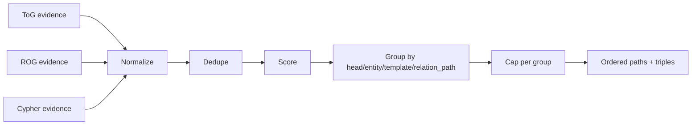

# KG 检索抽象技术设计方案

## 1. 背景

当前仓库的 KGQA 链路是一个标准的「关键词输入 -> 实体链接 -> 图路径检索 -> 下游预测/推荐」流程，主要落在 `feature/benchmark_recommendation/`：

- `recall_service.py` / `live_recall_service.py`：根据关键词在固定美学特征语料中召回节点。
- `pipeline.py`：编排召回、Neo4j 路径查询、路径展示、预测和推荐。
- `neo4j_repository.py`：同时承担 Cypher 模板、路径检索、缓存、路径展示顺序翻转、推荐查询。
- `path_morphology.py` / `path_postprocess.py`：处理路径形态、展示格式、去重和压缩。

这套实现已经能支持当前汽车美学 Benchmark，但检索逻辑仍强绑定在「汽车美学特征 -> 风格/车型」这个场景里。后续如果要扩展更多 KG 检索方式，例如：

1. 基于实体链接初始节点出发，参考 ToG 做关系剪枝、实体剪枝和多跳探索。
2. 基于 Schema、问题 Query 和实体链接结果，让大模型生成 N 条候选关系路径，再按这些路径 BFS 找相关三元组，参考 ROG。
3. 由业务或上游直接给出 Cypher 语句，检索层负责参数绑定、执行和结果标准化。
4. 混合向量召回、关键词匹配、LLM rerank 或图算法。

就需要把「实体链接」和「路径检索」抽成可复用的 KG Retrieval 层，让不同业务只通过配置、策略和结果 schema 接入。

## 2. 设计目标

本方案的目标是沉淀一个可复用的 KG 检索框架：

- 统一实体链接接口：离线召回、在线向量召回、关键词精确匹配、别名匹配、混合召回都产出同一种 `LinkedEntity`。
- 统一路径检索接口：ToG 剪枝探索、ROG 关系路径引导 BFS、直接 Cypher 执行都产出同一种 `RetrievedPath` / `RetrievedTriple`。
- 解耦业务语义：汽车风格、汽车车型、AssociatedWith、原图关系等变成配置或模板，不写死在基础检索层。
- 保留当前 KGQA 行为：新抽象先包住现有实现，保证输出兼容 `benchmark_evidence.json` / `benchmark_predict.json`。
- 支持调试和审计：每个阶段保留 source、score、rank、strategy、cypher/template、trace，便于复盘召回与路径质量。
- 支持多路检索融合：同一个 query 可以同时跑 ToG、ROG、Cypher，再做归一化、去重、排序。

非目标：

- 本阶段不重写预测和参数推荐逻辑。
- 本阶段不改变 Neo4j 导入格式。
- 本阶段不强行把所有业务字段标准化到一个大而全 ontology，只定义检索层的最小公共协议。

## 3. 当前链路分析

### 3.1 当前数据流



### 3.2 现有代码中的隐含抽象

| 当前概念 | 现有位置 | 实际抽象含义 |
| --- | --- | --- |
| `RecalledNode` | `schemas.py` | 实体链接结果 |
| `apply_recall_config()` | `recall_service.py` | 候选实体筛选策略 |
| `LiveRecallEngine.recall_by_case()` | `live_recall_service.py` | 在线实体链接器 |
| `batch_main_paths()` | `neo4j_repository.py` | 主路径检索器 |
| `batch_neighbor_evidence()` | `neo4j_repository.py` | 邻接证据检索器 |
| `MULTI_STYLE_PATH_QUERY` / `MULTI_TYPE_PATH_QUERY` | `neo4j_repository.py` | 固定 Cypher 路径模板 |
| `display_from_reverse_walk()` | `path_morphology.py` | 图内部方向到业务展示方向的转换 |
| `postprocess_case_paths()` | `path_postprocess.py` | 路径融合、去重、裁剪策略 |

### 3.3 主要耦合点

1. `BenchmarkNeo4jRepository` 既是底层 Neo4j 访问类，又写死了当前业务路径模板。
2. `pipeline.py` 直接知道召回来源、Neo4j 路径查询、路径展示和后处理细节。
3. 路径结果以 dict 流动，字段约束靠测试和调用方约定。
4. `StyleAssociatedWith` / `TypeAssociatedWith`、`汽车风格` / `汽车车型`、原图关系白名单都硬编码在模块级常量或 Cypher 字符串里。
5. 当前路径检索只能表达一种「从召回节点反走原图关系，再接 AssociatedWith 到头节点」的模式，难以直接复用到 ToG 剪枝探索、ROG 关系路径引导 BFS 或直接 Cypher 执行。

## 4. 总体架构

建议新增一个通用检索层：`feature/kg_retrieval/`。当前 `feature/benchmark_recommendation/` 作为第一个业务适配方，逐步迁移到这个检索层。



核心思想：

- 业务层只传 `KGQuery` 和 `RetrievalPlan`。
- 实体链接器只负责找候选起点。
- KG 检索器的统一输入是 `LinkedEntity`，检索方式可以是 ToG、ROG 或 Cypher。
- 融合层负责对路径和三元组证据做去重、排序、裁剪、审计。
- 业务层拿到标准化结果后，继续做 RAG、预测、推荐。

## 5. 核心数据模型

建议使用 dataclass 或 TypedDict，先保持轻量，不强制引入 Pydantic。

### 5.1 KGQuery

```python
@dataclass(frozen=True)
class KGQuery:
    query_id: str
    terms: tuple[str, ...]
    text: str
    metadata: Mapping[str, Any] = field(default_factory=dict)
```

说明：

- `terms` 保留原始关键词数组。
- `text` 是检索用拼接文本，例如当前的中文分号拼接。
- `metadata` 放业务上下文，例如 benchmark id、用户画像、目标答案类型。

### 5.2 LinkedEntity

```python
@dataclass(frozen=True)
class LinkedEntity:
    entity_id: str
    name: str
    labels: tuple[str, ...]
    score: float
    rank: int
    linker: str
    matched_terms: tuple[str, ...] = ()
    properties: Mapping[str, Any] = field(default_factory=dict)
```

对应当前 `RecalledNode`：

| 当前字段 | 新字段 |
| --- | --- |
| `node_id` | `entity_id` |
| `name` | `name` |
| `label` | `labels[0]` |
| `score` | `score` |
| `rank` | `rank` |
| `matched_keywords` | `matched_terms` |

### 5.3 PathStep、RetrievedPath 与 RetrievedTriple

```python
@dataclass(frozen=True)
class PathStep:
    source_id: str | None
    source_name: str
    relation: str
    target_id: str | None
    target_name: str
    direction: Literal["out", "in", "undirected"] = "out"


@dataclass(frozen=True)
class RetrievedPath:
    path_id: str
    query_id: str
    start_entity_id: str | None
    end_entity_id: str | None
    head_name: str | None
    head_kind: str | None
    steps: tuple[PathStep, ...]
    display_path: str
    hop_count: int
    score: float
    retriever: str
    template: str
    evidence_type: Literal["main_path", "neighbor", "tog", "rog", "cypher"]
    relation_path: tuple[str, ...] = ()
    metadata: Mapping[str, Any] = field(default_factory=dict)


@dataclass(frozen=True)
class RetrievedTriple:
    triple_id: str
    query_id: str
    subject_id: str | None
    subject_name: str
    relation: str
    object_id: str | None
    object_name: str
    score: float
    retriever: str
    source_path_id: str | None = None
    metadata: Mapping[str, Any] = field(default_factory=dict)
```

当前路径 dict 可以兼容映射：

| 当前字段 | 新字段 |
| --- | --- |
| `path` | `display_path` |
| `hop_count` / `hops` | `hop_count` |
| `template` | `template` |
| `head_name` | `head_name` |
| `head_kind` | `head_kind` |
| `recalled_id` | `start_entity_id` |
| `confidence` | `metadata.confidence` |

`RetrievedTriple` 主要用于 ROG 和 ToG 的中间证据，也可以从 Cypher 查询结果中映射得到。最终给 LLM/RAG 的上下文可以同时包含：

- `paths`：结构化路径，适合解释「为什么能到达答案头节点」。
- `triples`：具体三元组，适合提供可引用证据。

### 5.4 RetrievalResult

```python
@dataclass(frozen=True)
class RetrievalResult:
    query: KGQuery
    entities: tuple[LinkedEntity, ...]
    paths: tuple[RetrievedPath, ...]
    triples: tuple[RetrievedTriple, ...] = ()
    warnings: tuple[str, ...] = ()
    trace: Mapping[str, Any] = field(default_factory=dict)
```

这个结构可以作为所有 KGQA 下游的统一输入：

- RAG：用 `paths[*].display_path`、`triples` 和 `entities[*].properties.description`。
- 投票：用 `paths[*].head_name/head_kind/score`。
- 推荐：从 `predicted` 继续走专用业务查询。
- 调试：用 `trace` 还原用了哪些 linker/retriever/template/cypher。

## 6. 核心接口

### 6.1 EntityLinker

```python
class EntityLinker(Protocol):
    name: str

    def link(
        self,
        queries: Sequence[KGQuery],
        config: EntityLinkingConfig,
    ) -> Mapping[str, Sequence[LinkedEntity]]:
        ...
```

可先实现三类：

| 实现 | 复用当前代码 | 用途 |
| --- | --- | --- |
| `OfflineVectorEntityLinker` | `load_recall_topk()` + `apply_recall_config()` | 读取预计算 TopK |
| `LiveVectorEntityLinker` | `LiveRecallEngine` | 在线向量召回 |
| `KeywordEntityLinker` | 新增轻量实现 | exact/contains/alias 召回 |

实体链接器只负责输出候选实体，不知道路径怎么走。

### 6.2 KGRetriever

```python
class KGRetriever(Protocol):
    name: str

    def retrieve(
        self,
        query: KGQuery,
        entities: Sequence[LinkedEntity],
        config: PathRetrievalConfig,
    ) -> RetrievalEvidence:
        ...
```

其中 `entities` 是统一实体链接接口的输出。KG 检索层不再关心实体是离线向量召回、在线向量召回还是关键词匹配得到的，只把这些实体作为图检索起点或查询参数。

`RetrievalEvidence` 是一个轻量容器：

```python
@dataclass(frozen=True)
class RetrievalEvidence:
    paths: tuple[RetrievedPath, ...] = ()
    triples: tuple[RetrievedTriple, ...] = ()
    trace: Mapping[str, Any] = field(default_factory=dict)
```

统一检索接口下先定义三种一等方法：

| 实现 | 能力 |
| --- | --- |
| `ToGPrunedPathRetriever` | 从链接实体出发，多跳扩展图谱，并参考 ToG 做关系剪枝和实体剪枝 |
| `ROGGuidedBfsRetriever` | 将 Schema、Query、LinkedEntity 给大模型，生成 N 条候选关系路径，再按每条关系路径 BFS 找相关三元组 |
| `CypherStatementRetriever` | 直接执行业务给出的 Cypher 语句或注册模板，并把结果映射为路径/三元组证据 |

三种方法共用同一入口、同一输出，但决策来源不同：

- ToG：检索器在每一跳动态选择「扩展哪些关系、保留哪些实体」。
- ROG：大模型先规划关系路径，检索器再严格按关系路径找图证据。
- Cypher：业务直接给出可执行图查询，检索器只做参数绑定、执行和标准化。

### 6.3 GraphClient

把 Neo4j 的 `_read()` 从业务 repository 中抽出：

```python
class GraphClient(Protocol):
    def read(self, query: str, **params: Any) -> list[dict[str, Any]]:
        ...
```

当前 `Neo4jRecommendationRepository` 可以包装成 `Neo4jGraphClient`。这样通用检索层不依赖参数推荐 repository。

### 6.4 PathFormatter

```python
class PathFormatter(Protocol):
    def format(self, path: RetrievedPath) -> str:
        ...
```

当前 `path_morphology.py` 中的：

- `short_rel()`
- `format_path()`
- `inspect_path()`
- `display_from_reverse_walk()`

可以迁到 `feature/kg_retrieval/path_format.py`，业务层保留薄包装，避免一次性大改。

## 7. 检索计划 RetrievalPlan

建议通过配置对象描述一次 KG 检索要跑哪些策略：

```python
@dataclass(frozen=True)
class RetrievalPlan:
    entity_linkers: tuple[str, ...]
    kg_retrievers: tuple[str, ...]
    entity_config: EntityLinkingConfig
    retrieval_config: PathRetrievalConfig
    fusion_config: EvidenceFusionConfig
```

示例 1：复刻当前 KGQA，用 Cypher 模板承接 AssociatedWith 主路径。

```yaml
entity_linkers:
  - offline_vector
kg_retrievers:
  - cypher_statement
entity_config:
  mode: top_k_and_threshold
  top_k: 20
  min_score: 0.60
retrieval_config:
  cypher:
    statements:
      - name: benchmark_associated_main_path
        cypher_ref: benchmark.associated_main_path
      - name: benchmark_neighbor_evidence
        cypher_ref: benchmark.neighbor_evidence
    max_hops: 5
    per_pair: 2
    include_neighbor: true
fusion_config:
  dedupe_by: [template, head_name, start_entity_id, display_path]
```

示例 2：ToG 剪枝探索。

```yaml
entity_linkers:
  - live_vector
  - keyword
kg_retrievers:
  - tog_pruned_path
entity_config:
  top_k: 10
  min_score: 0.55
retrieval_config:
  tog:
    max_depth: 3
    beam_width: 8
    relation_top_k: 5
    entity_top_k: 20
    allowed_relations: ["Indicates(体现)", "ImplementedBy(由实现)", "Guides(指导)"]
    stop_labels: ["汽车风格", "汽车车型"]
fusion_config:
  max_paths: 50
```

示例 3：ROG 关系路径引导 BFS。

```yaml
entity_linkers:
  - offline_vector
kg_retrievers:
  - rog_guided_bfs
entity_config:
  top_k: 20
  min_score: 0.60
retrieval_config:
  rog:
    schema_ref: benchmark.car_aesthetic_schema
    relation_path_top_n: 8
    bfs_max_instances_per_path: 200
    bfs_direction: bidirectional
    llm_model: gpt-5-mini
    allowed_start_labels:
      - VehiclePosture(汽车姿态)
      - AestheticConcept(美学概念)
    target_labels:
      - 汽车风格
      - 汽车车型
fusion_config:
  max_paths: 50
  max_triples: 300
```

示例 4：直接给 Cypher。

```yaml
entity_linkers:
  - offline_vector
kg_retrievers:
  - cypher_statement
entity_config:
  top_k: 20
  min_score: 0.60
retrieval_config:
  cypher:
    statements:
      - name: user_defined_path
        query: |
          UNWIND $entity_ids AS eid
          MATCH p = (start:GraphNode {_graph_id: eid})-[:`Indicates(体现)`*1..3]-(evidence)
          RETURN p
        params:
          max_hops: 3
fusion_config:
  max_paths: 100
```

其中当前 `PathSearchConfig` 可以作为 `retrieval_config.cypher` 的兼容配置；后续 ToG 和 ROG 才需要启用对应子配置。

## 8. 三种 KG 检索方式如何纳入抽象

### 8.1 方法一：ToG 剪枝探索

ToG 方法的输入是实体链接结果，从链接实体作为图搜索起点。每一跳不盲目扩展全量邻居，而是先做关系剪枝，再做实体剪枝，只保留更可能通向答案或证据的 frontier。





ToG 配置重点：

- `max_depth`：最多探索几跳。
- `beam_width`：每一跳保留多少 partial path。
- `relation_top_k`：关系剪枝后保留多少关系。
- `entity_top_k`：实体剪枝后保留多少实体。
- `allowed_relations` / `blocked_relations`：图谱关系约束。
- `target_labels` / `stop_labels`：遇到哪些实体类型可以停止。
- `relation_scorer`：关系打分器，可以是规则、embedding 或 LLM。
- `entity_scorer`：实体打分器，可以综合实体链接分、节点文本相似度、路径长度惩罚。

适用场景：

- 问题没有明确路径 schema。
- 图谱规模较大，不能全量 BFS。
- 希望在探索过程中动态决定关系和实体。

### 8.2 方法二：ROG 关系路径引导 BFS

ROG 方法分两步。第一步让大模型基于图谱 Schema、问题 Query 和链接实体，生成 N 条候选关系路径；第二步检索器按每条关系路径在 KG 上做 BFS 或受限路径匹配，得到真实存在的三元组和路径证据。





ROG 的 relation path 不是最终证据，只是检索计划。例如：

```json
{
  "path_id": "rog_path_1",
  "relations": ["StyleAssociatedWith", "ImplementedBy", "Indicates(体现)"],
  "start_labels": ["VehiclePosture(汽车姿态)"],
  "target_labels": ["汽车风格"],
  "reason": "用户输入包含姿态和实现线索，需要回溯到风格头节点"
}
```

执行时基于每条关系路径做受限 BFS：

- 第 0 层 frontier 是 `LinkedEntity`。
- 第 k 层只允许走第 k 个 relation，或允许同义/反向关系变体。
- 每条路径收集命中的节点、边、三元组。
- 如果命中目标标签，就形成 `RetrievedPath`。
- 所有边都可展开为 `RetrievedTriple`，作为 RAG 证据。

ROG 配置重点：

- `schema_ref`：给大模型看的压缩 schema，可以包含 node labels、relations、方向、示例。
- `relation_path_top_n`：大模型最多返回多少条候选关系路径。
- `bfs_direction`：`out` / `in` / `bidirectional`。
- `bfs_max_instances_per_path`：每条关系路径最多保留多少命中。
- `relation_aliases`：关系同义词或业务展示名到真实 Neo4j type 的映射。
- `target_labels`：哪些节点类型可作为答案或证据终点。
- `llm_audit_json`：保存 schema、prompt、候选路径和执行统计。

适用场景：

- 图谱 schema 比较清楚，但每个问题的路径需要动态规划。
- 希望让 LLM 决定可能的关系路径，又希望最终证据来自真实图谱。
- 需要比 ToG 更强的全局路径规划能力，同时避免直接让 LLM 生成完整 Cypher 的不稳定性。

### 8.3 方法三：直接 Cypher 执行

直接 Cypher 方法适合当前这种路径已知、业务约束强、需要稳定执行的 KGQA。输入仍然可以带 `LinkedEntity`，但检索逻辑主要由 Cypher 决定。





Cypher 模式有两种输入：

1. `cypher_ref`：引用代码内注册模板，例如当前 `benchmark.associated_main_path`。
2. `query`：业务直接传入 Cypher 字符串，但必须只用参数绑定用户输入。

抽象后的模板配置可以写成：

```python
@dataclass(frozen=True)
class CypherStatement:
    name: str
    query: str
    params_builder: Callable[[KGQuery, Sequence[LinkedEntity], PathRetrievalConfig], dict[str, Any]]
    row_mapper: Callable[[Mapping[str, Any]], RetrievalEvidence]
```

当前四个主路径 query：

- `DIRECT_STYLE_PATH_QUERY`
- `DIRECT_TYPE_PATH_QUERY`
- `MULTI_STYLE_PATH_QUERY`
- `MULTI_TYPE_PATH_QUERY`

可以注册为一个逻辑 Cypher statement：

- `benchmark.associated_main_path`

邻接证据 query：

- `BATCH_NEIGHBOR_EVIDENCE_QUERY`

可以注册为：

- `benchmark.neighbor_evidence`

直接 Cypher 配置重点：

- `statements`：一个 query 可执行多条 Cypher。
- `params`：静态参数，例如 `max_hops`、`per_pair`。
- `params_builder`：把 `KGQuery` 和 `LinkedEntity` 转成 Cypher 参数。
- `row_mapper`：把 Neo4j row 转成 `RetrievedPath` 或 `RetrievedTriple`。
- `cache_key_builder`：缓存 key 必须包含 statement name、entity ids、max_hops 等。

适用场景：

- 路径规则非常稳定。
- 查询需要精确表达复杂约束。
- 要复用现有人工验证过的 Cypher。
- 线上对可控性、性能和可解释性要求高。

### 8.4 三种检索方式的边界对比

| 方法 | 谁决定关系路径 | 图上怎么执行 | 优点 | 风险 |
| --- | --- | --- | --- | --- |
| ToG | 检索过程逐跳决定 | 关系剪枝 + 实体剪枝 + frontier 扩展 | 灵活，适合未知路径 | 剪枝策略不好会漏召回 |
| ROG | LLM 先生成 N 条关系路径 | 按关系路径做受限 BFS | 全局路径规划强，证据仍来自 KG | LLM 可能生成不存在或低价值路径 |
| Cypher | 人或业务系统直接指定 | 参数化 Cypher 执行 | 稳定、可控、易优化 | 泛化能力弱，需要维护模板 |

## 9. 当前 Benchmark 的适配方案

### 9.1 新模块建议

```text
feature/kg_retrieval/
  __init__.py
  models.py                 # KGQuery / LinkedEntity / RetrievedPath / RetrievedTriple / RetrievalResult
  config.py                 # EntityLinkingConfig / PathRetrievalConfig / RetrievalPlan
  entity_linkers.py         # Protocol + offline/live/keyword linkers
  graph_client.py           # GraphClient + Neo4jGraphClient adapter
  kg_retrievers.py          # Protocol + ToG / ROG / Cypher retrievers
  cypher_statements.py      # CypherStatement registry
  path_format.py            # relation formatting and display helpers
  fusion.py                 # evidence dedupe/rank/cap
  service.py                # KGRetrievalService orchestration

feature/benchmark_recommendation/
  kg_retrieval_adapter.py   # benchmark-specific plan/templates/mappers
```

### 9.2 适配后的 Evidence 流程



`pipeline.py` 只保留业务编排，不再直接调用：

- `load_recall_topk()`
- `apply_recall_config()`
- `LiveRecallEngine.recall_by_case()`
- `neo4j_repository.batch_main_paths()`
- `neo4j_repository.batch_neighbor_evidence()`
- `_inspect_paths()`

这些调用迁到 `KGRetrievalService` 或 benchmark adapter 里。

### 9.3 向后兼容输出

短期仍输出当前 shape：

```json
{
  "id": "B001",
  "input": {"keywords": ["城市高坐姿"]},
  "recalled_nodes": [
    {"node_id": "meixue_1", "label": "VehiclePosture(...)", "name": "Command Seating", "score": 0.73}
  ],
  "paths": [
    {"path": "科技 -> StyleAssociatedWith -> Command Seating", "hop_count": 1}
  ]
}
```

内部可以多保存审计字段，但默认不暴露给现有下游，避免破坏测试和评测脚本。需要调试时通过 `--include-retrieval-trace` 开关输出：

```json
{
  "retrieval_trace": {
    "entity_linkers": ["offline_vector"],
    "kg_retrievers": ["cypher_statement"],
    "cypher_statements": ["benchmark.associated_main_path", "benchmark.neighbor_evidence"],
    "paths_raw": 128,
    "triples_raw": 256,
    "paths_kept": 36
  }
}
```

## 10. 排序、去重和融合

建议把当前 `path_postprocess.py` 中的规则提升为通用 `EvidenceFusion`，同时覆盖路径证据和三元组证据：



默认融合策略：

- 同一 `template + display_path` 去重。
- 同一 `subject_id + relation + object_id` 三元组去重。
- 主路径优先于邻接证据。
- 同一 `(head_kind, head_name, start_entity_id)` 保留最短路径。
- 路径分数默认 `entity_score / hop_count`。
- 可配置每类 head 保留数量，例如当前 `max_style_heads=3`、`max_type_heads=4`。
- 邻接证据默认不参与 head 裁剪，只作为补充上下文。

ToG / ROG 场景可以替换 scorer：

- `path_score = entity_score * relation_weight * node_relevance / path_length_penalty`
- ROG 可以给 LLM 生成的 relation path 一个 `planner_score`，再乘以 BFS 命中质量。
- 或使用 LLM 对 path/triple 做 rerank。

## 11. 配置设计

当前 `BenchmarkRecommendationConfig` 中的 `RecallConfig` 和 `PathSearchConfig` 可以逐步迁到通用配置。

### 11.1 通用配置草案

```python
@dataclass(frozen=True)
class EntityLinkingConfig:
    mode: Literal["top_k", "threshold", "top_k_and_threshold"] = "top_k_and_threshold"
    top_k: int = 20
    min_score: float = 0.60
    max_candidates: int = 50
    allowed_labels: tuple[str, ...] = ()


@dataclass(frozen=True)
class PathRetrievalConfig:
    tog: ToGConfig | None = None
    rog: ROGConfig | None = None
    cypher: CypherConfig | None = None


@dataclass(frozen=True)
class ToGConfig:
    max_depth: int = 3
    beam_width: int = 8
    relation_top_k: int = 5
    entity_top_k: int = 20
    allowed_relations: tuple[str, ...] = ()
    blocked_relations: tuple[str, ...] = ()
    target_labels: tuple[str, ...] = ()
    stop_labels: tuple[str, ...] = ()


@dataclass(frozen=True)
class ROGConfig:
    schema_ref: str
    relation_path_top_n: int = 8
    bfs_direction: Literal["out", "in", "bidirectional"] = "bidirectional"
    bfs_max_instances_per_path: int = 200
    target_labels: tuple[str, ...] = ()
    relation_aliases: Mapping[str, tuple[str, ...]] = field(default_factory=dict)
    llm_model: str | None = None
    llm_audit_json: str | None = None


@dataclass(frozen=True)
class CypherConfig:
    statements: tuple[CypherStatementRef, ...] = ()
    max_hops: int = 5
    per_pair: int = 2
    per_node: int = 2
    include_neighbor: bool = True


@dataclass(frozen=True)
class EvidenceFusionConfig:
    enable: bool = False
    max_paths: int | None = None
    max_triples: int | None = None
    max_heads_by_kind: Mapping[str, int] = field(default_factory=dict)
    dedupe_key: tuple[str, ...] = ("template", "display_path")
```

### 11.2 Benchmark 默认配置

```python
BENCHMARK_RETRIEVAL_PLAN = RetrievalPlan(
    entity_linkers=("offline_vector",),
    kg_retrievers=("cypher_statement",),
    entity_config=EntityLinkingConfig(
        mode="top_k_and_threshold",
        top_k=20,
        min_score=0.60,
        max_candidates=50,
        allowed_labels=(
            "AerodynamicFeature(空气动力学特征)",
            "AestheticConcept(美学概念)",
            "DesignAttribute(设计属性)",
            "DesignParameter(设计参数)",
            "FamilyDNA(家族DNA)",
            "UserTrend(用户与趋势)",
            "VehiclePosture(汽车姿态)",
        ),
    ),
    retrieval_config=PathRetrievalConfig(
        cypher=CypherConfig(
            statements=(
                CypherStatementRef("benchmark.associated_main_path"),
                CypherStatementRef("benchmark.neighbor_evidence"),
            ),
            max_hops=5,
            per_pair=2,
            per_node=2,
            include_neighbor=True,
        ),
    ),
    fusion_config=EvidenceFusionConfig(
        enable=False,
        max_heads_by_kind={"style": 3, "type": 4},
    ),
)
```

## 12. 迁移计划

建议分 5 个小阶段做，降低回归风险。

### 阶段 1：只新增模型和 adapter，不改变行为

新增：

- `feature/kg_retrieval/models.py`
- `feature/kg_retrieval/config.py`
- `feature/benchmark_recommendation/kg_retrieval_adapter.py`

完成：

- `RecalledNode -> LinkedEntity` 转换。
- `BenchmarkNeo4jRepository` 返回 dict -> `RetrievedPath` / `RetrievedTriple` 转换。
- `RetrievedPath -> 当前 public paths` 转换。

验收：

- 现有 `test/test_benchmark_recommendation.py` 全通过。
- 对同一输入，`benchmark_evidence.json` 的 `recalled_nodes` 和 `paths` 与迁移前一致。

### 阶段 2：抽出 EntityLinker

新增：

- `OfflineVectorEntityLinker`
- `LiveVectorEntityLinker`

改造：

- `pipeline.py` 不直接读 recall 文件或调用 `LiveRecallEngine`。
- 使用 `KGRetrievalService` 的 entity linking 部分。

验收：

- offline / live 两种召回结果保持当前排序和过滤行为。
- 召回空结果时仍触发 `skip_predict_empty_recall`。

### 阶段 3：抽出 KGRetriever，并先用 CypherStatement 承接现状

新增：

- `CypherStatementRetriever`
- `CypherStatement` registry
- `benchmark.associated_main_path`
- `benchmark.neighbor_evidence`
- `Neo4jGraphClient`

改造：

- `BenchmarkNeo4jRepository.batch_main_paths()` 可以先保留为 facade，内部调用 `CypherStatementRetriever`。
- 或相反：`CypherStatementRetriever` 先包装现有 `batch_main_paths()`，之后再下沉 Cypher statement。

验收：

- `test_cypher_keeps_associated_with_off_the_variable_walk`
- `test_path_queries_use_shared_graph_node_label`
- `test_max_hops_is_pushed_into_cypher_and_empty_results_are_cached`
- `test_max_hops_one_skips_multi_path_queries`
- `test_neighbor_results_are_cached_by_recalled_id`

这些测试语义必须保持。

### 阶段 4：新增 ToGPrunedPathRetriever

新增：

- `ToGPrunedPathRetriever`
- `RelationScorer`
- `EntityScorer`
- `EvidenceFusion`

完成：

- 支持从 `LinkedEntity` 起点做多跳扩展。
- 支持关系剪枝、实体剪枝、beam search 和 stop labels。
- ToG 输出标准 `RetrievedPath` / `RetrievedTriple`。

验收：

- 新增单测覆盖 ToG depth/beam/stop label 行为。
- 新增单测覆盖关系剪枝、实体剪枝和空 frontier 行为。
- 新增单测覆盖 `EvidenceFusion` 对最短路径和 head cap 的处理。

### 阶段 5：新增 ROGGuidedBfsRetriever

新增：

- `ROGGuidedBfsRetriever`
- `SchemaProvider`
- `RelationPathPlanner`
- `ConstrainedBfsExecutor`

完成：

- 将 Schema、Query、LinkedEntity 交给 LLM 生成 N 条 relation paths。
- 对每条 relation path 执行受限 BFS，收集真实存在的三元组和路径。
- 保存 LLM path planning 审计日志，便于排查错误路径。

验收：

- 新增单测覆盖 relation path JSON 解析与校验。
- 新增单测覆盖按关系序列 BFS。
- 新增单测覆盖不存在关系路径时返回空证据和 warning。
- 新增集成测试对比 ROG 与 Cypher 在当前 Benchmark 小样本上的证据重合情况。

## 13. 测试策略

### 13.1 单元测试

| 测试对象 | 关键断言 |
| --- | --- |
| `KGQuery` normalizer | 空关键词报错；拼接文本稳定 |
| `OfflineVectorEntityLinker` | top_k/threshold 逻辑与 `apply_recall_config()` 一致 |
| `LiveVectorEntityLinker` | score 排序、rank、matched_terms 与当前一致 |
| `CypherStatementRetriever` | 参数传递、max_hops 替换、空结果缓存 |
| `benchmark.associated_main_path` | AssociatedWith 不进入 variable walk |
| `benchmark.neighbor_evidence` | 不包含风格/车型/实例/级别邻居 |
| `ToGPrunedPathRetriever` | depth/beam/关系剪枝/实体剪枝 |
| `ROGGuidedBfsRetriever` | relation path 生成结果校验、按关系序列 BFS |
| `EvidenceFusion` | 路径/三元组去重、最短路径优先、head cap |

### 13.2 回归测试

固定一小组 benchmark case，保存迁移前 evidence 输出作为 golden：

```text
test/fixtures/kg_retrieval/
  benchmark_evidence_before_abstraction.json
```

对比字段：

- `id`
- `recalled_nodes[*].node_id/name/score`
- `paths[*].path/hop_count`

浮点分数允许 `1e-6` 误差。

### 13.3 集成测试

保留现有命令：

```bash
cd test
PYTHONPATH=.. python3 -m unittest test_benchmark_recommendation test_benchmark_fixed_type_recall
```

新增可选集成测试：

```bash
PYTHONPATH=. python3 -m feature.benchmark_recommendation.run_benchmark_recommendation \
  --stage evidence \
  --recall-source offline \
  --recall-top20-jsonl data/recall_top20.jsonl \
  --graph-jsonl data/kgdata_0804_assoc_bridges.jsonl \
  --benchmark-inputs-jsonl benchmark/benchmark_100_inputs.jsonl \
  --env feature/.env \
  --output-json /tmp/benchmark_evidence_after_abstraction.json
```

## 14. 风险与规避

| 风险 | 影响 | 规避 |
| --- | --- | --- |
| 抽象过度导致实现复杂 | 迁移慢，业务难理解 | 先抽接口和模型，保留现有业务 adapter |
| 输出 shape 改变 | 下游预测/推荐/评测脚本失败 | 默认输出完全兼容，trace 走开关 |
| Cypher 模板动态化带来注入风险 | 查询安全和稳定性下降 | 模板注册在代码内；用户输入只走参数，不拼字符串 |
| ToG 召回路径过多 | 性能和上下文爆炸 | beam_width、max_depth、relation whitelist、EvidenceFusion cap |
| ROG 生成不存在的关系路径 | BFS 空跑或证据很少 | relation path schema 校验、relation aliases、空结果 warning、审计日志 |
| 多 linker 分数不可比 | 排序不稳定 | 分 linker 做归一化，融合时保留 source score 和 normalized score |
| 缓存 key 变化造成重复查询 | Neo4j 压力上升 | 缓存 key 显式包含 retriever、statement/path、node_id、max_hops、per_pair |

## 15. 推荐落地顺序

优先级建议：

1. 先做 `models.py` 和 `kg_retrieval_adapter.py`，让当前 dict 输出能和标准模型互转。
2. 再做 `EntityLinker`，这是收益最高且风险最低的一层。
3. 然后做 `CypherStatementRetriever`，把当前 `BenchmarkNeo4jRepository` 中的路径查询和推荐查询拆开。
4. 再补 `ToGPrunedPathRetriever`，支持基于链接实体的关系剪枝和实体剪枝探索。
5. 最后补 `ROGGuidedBfsRetriever`，支持 LLM 生成关系路径后受限 BFS 找三元组。

这样可以保证每一步都有可运行系统，不需要一次性推倒重来。

## 16. 建议的最终调用方式

未来业务层只需要：

```python
queries = [
    KGQuery(
        query_id=case["id"],
        terms=tuple(case["keywords"]),
        text="；".join(case["keywords"]),
    )
    for case in cases
]

service = KGRetrievalService(
    entity_linkers=entity_linker_registry,
    kg_retrievers=kg_retriever_registry,
    fusion=EvidenceFusion(),
)

results = service.retrieve_batch(
    queries=queries,
    plan=BENCHMARK_RETRIEVAL_PLAN,
)
```

当前 KGQA 输出适配：

```python
responses = [
    benchmark_result_to_response(result)
    for result in results
]
```

新增 KGQA 任务只需要换：

- `RetrievalPlan`
- entity linker 组合
- KG retriever 组合：ToG / ROG / Cypher
- Cypher statement / ROG schema / ToG scorer
- 可选 fusion scorer

不用复制 `pipeline.py` 或改动 Neo4j repository 的业务硬编码。

## 17. 小结

这次抽象的核心不是把代码「做大」，而是把当前已经存在的三个概念正式命名并固定边界：

- `EntityLinker`：把用户文本链接到 KG 起点。
- `KGRetriever`：以链接实体为输入，通过 ToG、ROG 或 Cypher 取回图证据。
- `EvidenceFusion`：把多路路径和三元组证据变成稳定、可解释、可投喂下游的结果。

当前汽车美学 KGQA 可以作为第一个 adapter 保持兼容；后续 ToG 剪枝探索、ROG 关系路径引导 BFS、直接 Cypher 执行都能接到同一套接口上复用。
