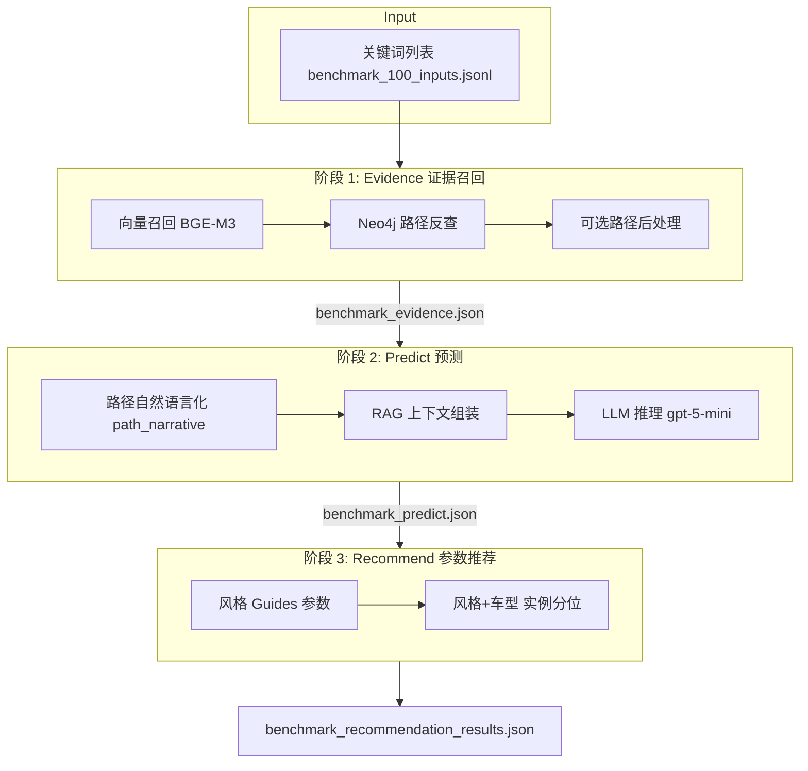
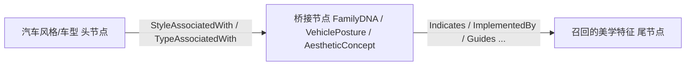
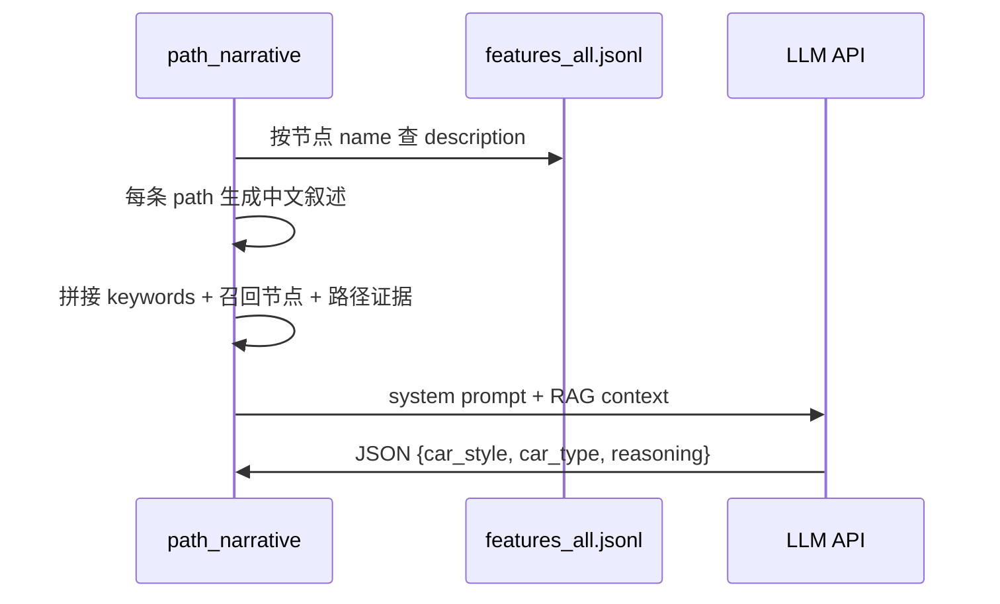
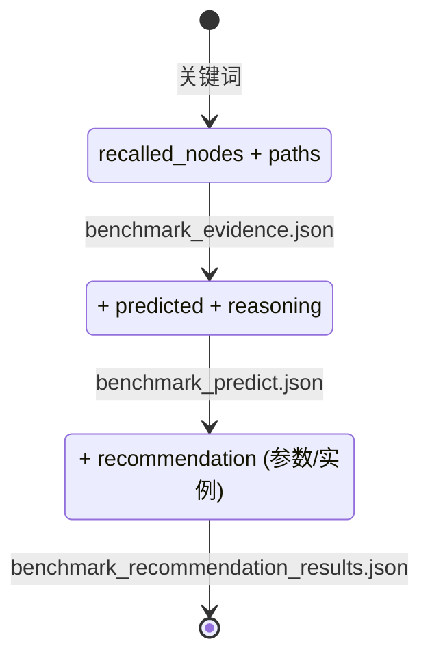

# Benchmark 推荐链路技术文档

本文档描述 `feature/benchmark_recommendation/` 的三阶段流水线：**证据召回（Evidence）→ 风格/车型预测（Predict）→ 参数推荐（Recommend）**。阅读本文即可理解每阶段做什么、如何实现、以及如何独立或串联运行。

---

## 1. 问题与目标

甲方 Benchmark 输入为 **关键词列表**（如 `["城市高坐姿", "短前后悬", "像素灯语"]`），期望输出：

| 阶段 | 输出 |
|------|------|
| 证据召回 | 召回的美学特征节点 + 知识图谱路径 |
| 预测 | `car_style`（汽车风格）、`car_type`（汽车车型）、可选 `car_level` |
| 参数推荐 | 风格设计参数指南、风格+车型实例尺寸分位等 |

技术路线：**向量召回 → Neo4j 路径检索 → 路径自然语言化（RAG 上下文）→ 闭源 LLM 推理 → 图谱参数查询**。

---

## 2. 整体架构



---

## 3. 阶段详解

### 3.1 阶段 1：证据召回（Evidence）

**做什么：** 根据关键词在七类美学特征语料上做向量相似度召回，再在 Neo4j 知识图谱上反查从特征到「汽车风格 / 汽车车型」的路径。

**输入：**
- `benchmark/benchmark_100_inputs.jsonl` — 每行 `{id, keywords}`
- `data/recall_top20.jsonl`（离线）或在线 BGE-M3 实时嵌入
- Neo4j 图（`data/kgdata_0804_assoc_bridges.jsonl` 导入）

**核心模块：**

| 模块 | 职责 |
|------|------|
| `recall_service.py` | Top-K + 阈值过滤召回节点 |
| `live_recall_service.py` | 在线 BGE-M3 嵌入召回 |
| `neo4j_repository.py` | Cypher 批量路径查询 |
| `path_morphology.py` | 路径展示格式（AssociatedWith 末跳） |
| `path_postprocess.py` | 可选后处理：去重、风格 Top3 / 车型 Top4 |

**路径形态（甲方主路径）：**



- 中间跳只允许原图关系（`Indicates`、`ImplementedBy` 等），**不含** AssociatedWith 在中间。
- AssociatedWith 仅作为最后一跳，连接风格/车型头与桥接节点或直接连召回尾节点。

**召回超参数（`scripts/config.sh`）：**

| 变量 | 默认 | 说明 |
|------|------|------|
| `RECALL_SOURCE` | `offline` | `offline` 读预计算文件；`live` 在线 BGE-M3 |
| `TOP_K` | 10 | 先取 Top-K 再过滤 |
| `MIN_SCORE` | 0.65 | 余弦相似度阈值 |
| `MAX_HOPS` | 5 | 保留 1..N 跳主路径 |
| `INCLUDE_NEIGHBOR` | 1 | 是否包含 1 跳邻接证据 |
| `ENABLE_PATH_POSTPROCESS` | 0 | 1=启用后处理 |
| `MAX_STYLE_HEADS` / `MAX_TYPE_HEADS` | 3 / 4 | 后处理保留的头数量 |

**输出文件：** `artifacts/benchmark_evidence.json`

```json
{
  "stage": "evidence",
  "cases": [{
    "id": "B001",
    "input": {"keywords": ["城市高坐姿", "..."]},
    "recalled_nodes": [{"node_id": "...", "name": "...", "score": 0.73}],
    "paths": [{"path": "科技 -> StyleAssociatedWith -> ...", "hop_count": 3}]
  }]
}
```

---

### 3.2 阶段 2：风格/车型预测（Predict）

**做什么：** 将路径与节点描述转为自然语言，作为 RAG 上下文，调用闭源 LLM 推理出 `car_style` / `car_type`。

**为什么需要自然语言化：** 路径本身是结构化字符串；节点在 `data/features_all.jsonl` 中有英文/中文描述。拼接后 LLM 才能做语义对齐与意图过滤（例如剔除与用户「城市 SUV」意图冲突的「硬派越野」路径头）。

**核心模块：**

| 模块 | 职责 |
|------|------|
| `path_narrative.py` | 路径 → 中文叙述；组装 RAG context |
| `llm_predictor.py` | 调用 `feature/.env` 中的 API；解析 JSON 预测 |
| `prediction_service.py` | 备用：路径头投票（`PREDICTION_MODE=vote`） |

**RAG 上下文构建流程：**



**预测超参数：**

| 变量 | 默认 | 说明 |
|------|------|------|
| `PREDICTION_MODE` | `llm` | `llm` 或 `vote`（路径投票，无 API 调用） |
| `LLM_MODEL` | 空 | 空则读 `.env` 的 `MODEL_NAME` |
| `MAX_PATHS_IN_CONTEXT` | 30 | 送入 LLM 的最大路径条数 |
| `LLM_WORKERS` | 4 | 并发 LLM 请求数 |
| `LLM_AUDIT_JSON` | `artifacts/benchmark_llm_audit.json` | 每次调用的 input/output 审计 JSON |
| `LLM_SHOW_PROGRESS` | 1 | stderr 进度 `[LLM predict] N/100 Bxxx done` |
| `LLM_TEMPERATURE` | 0.1 | 生成温度 |

**封闭词表（LLM 必须从中选择）：**
- 风格：`科技、运动、豪华、硬派越野、简约、商务、复古`
- 车型：见 `feature/benchmark_upstream_offline/constants.py` 中 `CAR_TYPES`

**输出文件：** `artifacts/benchmark_predict.json`

`predicted.car_style` / `predicted.car_type` 为名称数组（例如 `["简约","科技"]`），不含 `score` / `support` / `prediction_mode` / `confidence`。证据不足时对应数组为空 `[]`。`paths` 只保留 `path` 与 `hop_count`。

---

### 3.3 阶段 3：参数推荐（Recommend）

**做什么：** 根据预测出的风格/车型（及可选级别），在 Neo4j 上查询：

1. **style_guides** — 风格 → `Guides` → 设计参数
2. **style_type** — 风格 + 车型 → 汽车实例 → 车身尺寸分位（P25/中位数/P75）
3. **style_type_level** — 再加级别过滤（样本不足时可回退）

**核心模块：** `recommendation_strategies.py`、`neo4j_repository.py`

**输出文件：** `artifacts/benchmark_recommendation_results.json`

---

## 4. 运行方式

所有脚本位于 `feature/benchmark_recommendation/scripts/`，超参数在 `config.sh` 中定义，可通过环境变量覆盖。

### 4.1 主入口（推荐）

```bash
cd feature/benchmark_recommendation/scripts

# 仅阶段 1：证据召回
PIPELINE=1 ./run.sh

# 阶段 1 + 2：召回 + LLM 预测
PIPELINE=12 ./run.sh

# 完整三阶段
PIPELINE=123 ./run.sh
# 或
./run.sh
```

### 4.2 独立阶段脚本

```bash
./run_evidence.sh          # 阶段 1（同 run_path.sh）
./run_predict.sh           # 阶段 2（若已有 evidence.json 则复用）
./run_recommend.sh         # 阶段 3（若已有 predict.json 则复用）
```

### 4.3 从中间产物续跑

```bash
# 已有 evidence，只做预测
INPUT_JSON=artifacts/benchmark_evidence.json PIPELINE=2 ./run.sh

# 已有 predict，只做推荐
INPUT_JSON=artifacts/benchmark_predict.json PIPELINE=3 ./run.sh
```

### 4.4 常用超参数示例

```bash
# 更宽松的召回 + 启用路径后处理
MIN_SCORE=0.60 TOP_K=20 ENABLE_PATH_POSTPROCESS=1 PIPELINE=1 ./run.sh

# 使用投票预测（不调用 LLM，调试路径用）
PREDICTION_MODE=vote PIPELINE=12 ./run.sh

# 在线向量召回（需 GPU）
RECALL_SOURCE=live PIPELINE=1 ./run.sh
```

### 4.5 Python CLI（等价）

```bash
python3 -m feature.benchmark_recommendation.run_benchmark_recommendation \
  --stage evidence \
  --recall-source offline \
  --recall-top20-jsonl data/recall_top20.jsonl \
  --graph-jsonl data/kgdata_0804_assoc_bridges.jsonl \
  --benchmark-inputs-jsonl benchmark/benchmark_100_inputs.jsonl \
  --env feature/.env \
  --min-score 0.65 --top-k 10 --max-hops 5 \
  --output-json feature/benchmark_recommendation/artifacts/benchmark_evidence.json
```

`--stage` 可选：`recall` | `evidence` | `path`（evidence 别名）| `predict` | `recommend`

预测阶段额外参数：`--prediction-mode llm|vote`、`--input-json`、`--enable-path-postprocess`

---

## 5. 目录结构

```text
feature/benchmark_recommendation/
├── pipeline.py              # 三阶段编排
├── recall_service.py        # 召回过滤
├── live_recall_service.py   # 在线 BGE-M3
├── neo4j_repository.py      # Neo4j 路径与推荐查询
├── path_morphology.py       # 路径格式
├── path_postprocess.py      # 路径后处理
├── path_narrative.py        # RAG 自然语言化  ← 新增
├── llm_predictor.py         # LLM 预测        ← 新增
├── prediction_service.py    # 投票预测 / 级别推断
├── recommendation_strategies.py
├── run_benchmark_recommendation.py  # CLI
├── config.py / schemas.py
├── scripts/
│   ├── config.sh            # 全部超参数
│   ├── run.sh               # 主入口 PIPELINE=1|12|123
│   ├── run_evidence.sh
│   ├── run_predict.sh
│   ├── run_recommend.sh
│   └── run_postprocess.sh   # 独立后处理（兼容旧流程）
└── artifacts/               # 输出（gitignore）
```

---

## 6. 环境依赖

```bash
pip install -r requirements.txt
cp feature/.env.example feature/.env   # 填写 Neo4j + LLM
```

**`feature/.env` 必填项：**

| 键 | 用途 |
|----|------|
| `NEO4J_URI` / `NEO4J_USERNAME` / `NEO4J_PASSWORD` | 阶段 1 路径查询、阶段 3 参数推荐 |
| `API_KEY` / `BASE_URL` / `MODEL_NAME` | 阶段 2 LLM 预测（OpenAI 兼容接口） |

---

## 7. 数据流与阶段产物



---

## 8. 设计决策

1. **阶段解耦：** 每阶段输出标准 JSON，支持 `INPUT_JSON` 续跑，便于调试召回/路径而不重复调用 LLM。
2. **LLM 为主、投票为备：** 默认 `PREDICTION_MODE=llm`；路径头投票保留作 baseline 与 LLM 失败回退。
3. **后处理可选：** `ENABLE_PATH_POSTPROCESS=1` 在 evidence 阶段内联执行，替代原先独立的 `run_postprocess.sh`（仍保留兼容）。
4. **路径自然语言化：** 使用 `features_all.jsonl` 中的节点描述，不额外调用 LLM 做摘要，降低成本与延迟。

---

## 9. 测试

```bash
cd test
PYTHONPATH=.. python3 -m unittest test_benchmark_recommendation -v
```

---

## 10. 已知边界

- 路径头覆盖多种风格/车型来自图连通性；LLM 意图过滤旨在收口，但不保证与甲方 `predicted` 100% 一致。
- `MIN_SCORE` 过高会导致空召回、空路径。
- 全量 100 条 LLM 预测会产生 API 费用；建议先用 `PIPELINE=1` 检查证据，再小批量验证预测。
