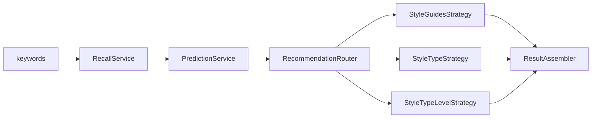

# Benchmark 关键词到模块化参数推荐技术方案

## 1. 目标与范围

输入一组与甲方 Benchmark 相同格式的 `keywords`，依次完成：

```text
keywords
  → 固定类型节点向量召回
  → 汽车风格 / 汽车车型 / 汽车级别预测
  → 按上下文选择推荐策略
  → 输出设计参数、数值建议和完整证据
```

本方案复用现有 BGE-M3 embedding、`StyleAssociatedWith`、`TypeAssociatedWith`、`Guides(指导)`、`EXPRESSES_STYLE` 和车型/级别实例数据，不让大模型在线临时生成参数。

术语统一：

- `car_style`：科技、运动、豪华、硬派越野、简约、商务、复古。
- `car_type`：图中的 21 个 `汽车车型`，如紧凑型 SUV、跑车、皮卡。
- `car_level`：图中的 `汽车级别`，如 A0 级、A 级、B 级；它不是第四种分类。

## 2. 总体架构



| 模块 | 职责 | 可替换点 |
|---|---|---|
| `RecallService` | keywords embedding、余弦检索、候选过滤 | 模型、Top-K、阈值、按类型配额 |
| `PredictionService` | 召回节点经 AssociatedWith 加权得到风格/车型，再推断级别 | 投票公式、分类阈值、歧义规则 |
| `RecommendationRouter` | 根据已获得的上下文选择推荐策略 | 策略优先级、回退方式 |
| `RecommendationStrategy` | 执行参数化 Cypher 和业务聚合 | 每种推荐算法独立实现 |
| `ResultAssembler` | 统一输出预测、参数、样本数、路径和告警 | 输出 Schema |

建议代码结构：

```text
feature/benchmark_recommendation/
  schemas.py
  config.py
  pipeline.py
  recall/service.py
  prediction/service.py
  repositories/neo4j.py
  recommendation/base.py
  recommendation/style_guides.py
  recommendation/style_type.py
  recommendation/style_type_level.py
```

## 3. 节点召回

### 3.1 检索范围与文本

只检索当前已验证的七类、9,649 个固定节点：

```text
AerodynamicFeature / AestheticConcept / DesignAttribute /
DesignParameter / FamilyDNA / UserTrend / VehiclePosture
```

- 查询文本：keywords 按原顺序用中文分号拼接。
- 节点文本：`名称 + 描述`，标签不进入 embedding，避免类型词泄漏。
- 模型：复用固定 revision 的 `BAAI/bge-m3`，向量归一化后点积即余弦相似度。

### 3.2 可配置召回策略

统一配置：

```yaml
recall:
  mode: top_k_and_threshold  # top_k | threshold | top_k_and_threshold
  top_k: 20
  min_score: 0.60
  max_candidates: 50        # threshold 模式的安全上限
```

三种模式语义必须固定：

- `top_k`：仅取前 K 个。
- `threshold`：取全部 `score >= min_score`，但最多 `max_candidates` 个。
- `top_k_and_threshold`：先取 Top-K，再删除低于阈值的节点。

每个候选至少输出 `node_id、label、name、score、rank`。余弦分数是相似度，不命名为 confidence。

## 4. 风格、车型和级别预测

召回节点通过图上已有的一跳边进行聚合：

```cypher
MATCH (n)-[r:StyleAssociatedWith]->(s:`汽车风格`)
WHERE n._graph_id IN $node_ids
RETURN s.name AS name,
       sum(r.confidence * $recall_score_by_id[n._graph_id]) AS score,
       count(DISTINCT n) AS support
ORDER BY score DESC, support DESC, name
```

车型同理，将关系和目标节点改为 `TypeAssociatedWith`、`汽车车型`。如果 Neo4j 版本不支持 map 动态取值，应用层传入 `{node_id, recall_score}` 后用 `UNWIND` 匹配。

推荐投票公式：

```text
candidate_score = Σ(recall_similarity × edge_confidence)
```

输出 Top-1 或 Top-2；第一、第二名分差低于配置值时保留两者，并设置 `need_user_confirmation=true`。没有有效边时字段留空，不用关键词或 LLM 强行补标签。

`car_level` 不单独建 `LevelAssociatedWith`，按以下优先级得到：

1. 从预测 `car_type → 汽车实例 ← 汽车级别` 的实例分布推断；
2. keywords 明确包含“紧凑、中型、大型、A 级”等时做一致性校验或补充；
3. 图分布冲突或证据不足时留空并要求确认。

## 5. 模块化推荐策略

所有策略实现统一接口：

```python
class RecommendationStrategy:
    def supports(self, context) -> bool: ...
    def recommend(self, context) -> RecommendationResult: ...
```

### 5.1 仅汽车风格：`StyleGuidesStrategy`

返回风格直接指导的设计参数、范围、单位和指导方式。这是“设计意图推荐”，不是实车数值统计。

```cypher
MATCH (s:`汽车风格`)-[g:`Guides(指导)`]->(p:`DesignParameter(设计参数)`)
WHERE s.name = $car_style
RETURN p.name AS parameter,
       properties(p) AS parameter_properties,
       properties(g) AS guidance
ORDER BY parameter
LIMIT $limit
```

### 5.2 汽车风格 + 汽车车型：`StyleTypeStrategy`

先用车型圈定实例，再通过 `EXPRESSES_STYLE` 找到属于目标风格的**全部汽车实例**。这里不再对关系上的 `score` 或 `confidence` 做二次阈值过滤；只要图上已有该风格关系，该实例就进入聚合集合。读取这些实例的参数属性并输出中位数、P25–P75、实际范围和样本数。

```cypher
MATCH (t:`汽车车型`)-[:`包含`]->(v:`汽车实例`)
MATCH (v)-[:EXPRESSES_STYLE]->(s:`汽车风格`)
WHERE t.name = $car_type
  AND s.name = $car_style
RETURN DISTINCT v._graph_id AS vehicle_id,
       v.`车型名称` AS model_name,
       properties(v) AS vehicle_properties
```

聚合在应用层完成：从 `vehicle_properties` 中提取可推荐的数值参数，统一单位后计算 `min、P25、median、P75、max、sample_count`。如果实际参数存放在汽车实例关联的车身/参数节点中，由 Repository 在查询层多取这些节点并扁平化，Strategy 的输入仍保持统一的“实例参数字典”。可同时读取该车型全部实例作为 baseline，给出风格子集相对车型基线的差值。

### 5.3 汽车风格 + 汽车车型 + 汽车级别：`StyleTypeLevelStrategy`

在上一策略的实例集合上，再通过 `汽车级别 ─[:包含]→ 汽车实例` 多走一跳，用预测的 `car_level` 限定实例，然后对剩余实例的属性按同样方式聚合：

```cypher
MATCH (t:`汽车车型`)-[:`包含`]->(v:`汽车实例`)<-[:`包含`]-(l:`汽车级别`)
MATCH (v)-[:EXPRESSES_STYLE]->(s:`汽车风格`)
WHERE t.name = $car_type
  AND l.name = $car_level
  AND s.name = $car_style
RETURN DISTINCT v._graph_id AS vehicle_id,
       v.`车型名称` AS model_name,
       properties(v) AS vehicle_properties
```

这层不需要重新判断车辆级别：每个汽车实例已经通过 `汽车级别 ─[:包含]→ 汽车实例` 挂在对应级别下，查询时增加这一跳即可。若交集样本过少，仍返回实际样本数和范围，同时增加 `small_sample_warning`；是否回退到 `StyleTypeStrategy` 作为独立配置，不改变本策略的聚合口径。

路由优先级：

```text
style + type + level → StyleTypeLevelStrategy
style + type         → StyleTypeStrategy
style                → StyleGuidesStrategy
否则                 → 不推荐，返回缺失字段
```

如果 style/type 各保留多个候选，只执行得分最高的有限组合（例如最多 4 组），每组结果独立保留上下文分数，不把不同组合的参数混成一个区间。

## 6. 输入与输出协议

请求示例：

```json
{
  "id": "B001",
  "keywords": ["城市高坐姿", "短前后悬", "像素灯语", "紧凑灵活"],
  "recall": {"mode": "top_k_and_threshold", "top_k": 20, "min_score": 0.60},
  "recommendation": {"max_styles": 2, "max_types": 2, "small_sample_threshold": 10}
}
```

响应核心结构：

```json
{
  "id": "B001",
  "recalled_nodes": [],
  "predicted": {
    "car_style": [{"name": "科技", "score": 0.82, "support": 5}],
    "car_type": [{"name": "紧凑型SUV", "score": 0.76, "support": 4}],
    "car_level": {"name": "A级", "source": "type_instance_distribution"}
  },
  "need_user_confirmation": false,
  "recommendation": {
    "strategy": "style_type_level",
    "sample_count": 32,
    "parameters": [],
    "fallback_reason": null
  },
  "paths": [],
  "warnings": []
}
```

`paths` 只记录实际参与决策的一跳关系和推荐查询证据，不伪造多跳解释。

## 7. 工程约束与验收

- 所有 Cypher 使用参数，封闭词表预测后用 `=` 精确匹配；`CONTAINS` 只可用于交互式名称搜索，不能进入正式推荐查询。
- `EXPRESSES_STYLE` 在组合推荐中只用于确定实例是否属于目标风格，不按关系的 `score/confidence` 再次过滤。
- 数值聚合只接受白名单参数和可解析标量；字符串范围不得直接参与分位数计算。
- 现有 `neo4j_recommend.py` 的 `car_class` 实际匹配 `汽车级别`；新接口必须拆成 `car_type` 与 `car_level`，避免沿用含混命名。
- Repository 启动时做图 Schema 自检，确认主风格节点及 `Guides`、`EXPRESSES_STYLE` 的实际标签；业务层只使用统一的 `汽车风格` 逻辑模型。
- 每次结果记录模型 revision、召回配置、投票配置、Cypher/策略版本和图数据版本。
- 单元测试覆盖三种召回模式、加权投票、歧义、无边、级别冲突、策略路由和样本不足回退。
- Benchmark 验收分三层：节点召回人工相关性、style/type/level case 级命中、参数推荐的样本数与数值区间合理性。

## 8. 实施顺序

1. 将现有 `benchmark_fixed_type_recall` 封装成在线 `RecallService`，先支持 Top-K、阈值和组合模式。
2. 实现 AssociatedWith 加权投票和级别推断，先跑通 100 条 Benchmark 分类结果。
3. 从现有 `neo4j_recommend.py` 抽出 Repository 与三种 Strategy，保留原聚合函数。
4. 接入统一 Pipeline 和输出 Schema，最后做 Benchmark 回归、人工抽查和阈值校准。
