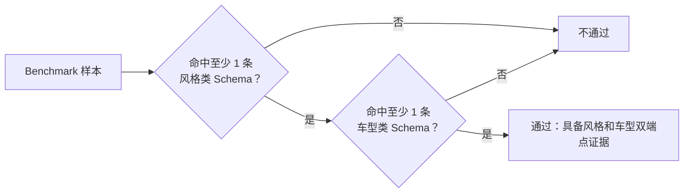
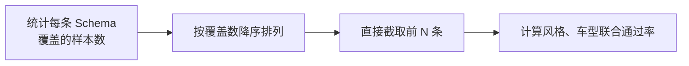
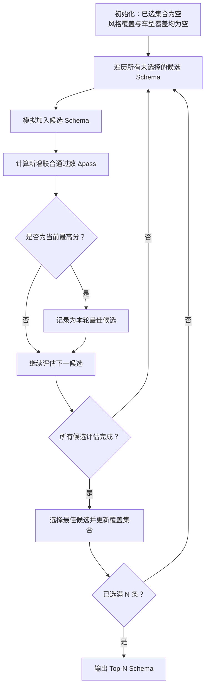
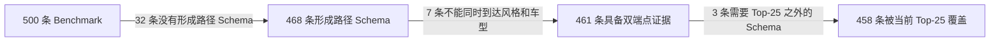

# Top-N Schema 选取方法与 500 条 Benchmark 验证报告

> 汇报对象：项目甲方  
> 验证数据：500 条 Benchmark 样本  
> 当前推荐配置：`N = 25`

## Executive Summary

- **本次优化解决的不是“找出现次数最多的 Schema”，而是“用有限数量的 Schema 让尽可能多的样本同时具备风格和车型路径证据”。** 两个目标并不等价：高频 Schema 之间可能大量重复，也可能集中在同一个输出类别。
- **老方法按单条 Schema 的覆盖频次直接取前 N；当前方法按“新增联合通过样本数”逐轮贪心选择。** 当前方法会动态考虑已经覆盖的样本，并自动补齐风格、车型两类证据，不预先规定两类 Schema 的固定配额。
- **在相同的 500 条样本、相同候选集合和相同通过条件下，Top-25 联合覆盖率由 83.4% 提升至 91.6%。** 通过样本由 417 条增加至 458 条，净增 41 条，提升 8.2 个百分点。
- **N=25 已接近当前路径数据的可达上限。** 全部 820 条候选 Schema 最多使 461 条样本同时到达风格和车型；Top-25 已覆盖其中 458 条，即达到当前可达上限的 99.3%。从 25 增加到 50 仅再增加 3 条通过样本，因此继续扩大 N 的边际收益很低。

**建议：当前阶段继续采用 Top-25 和联合通过率导向的贪心算法；在交付结论中将 91.6% 表述为“Schema 结构联合覆盖率”，不要表述为预测准确率。**

## 1. Top-N Schema 到底在选什么

### 1.1 Schema 是具体路径的结构抽象

系统会从关键词召回的图谱节点出发，沿知识图谱关系找到汽车风格或汽车车型。具体节点名称很多，但它们可能具有相同的节点类型和关系结构，因此可以抽象成同一个 Schema。

例如，一条具体路径可以抽象为：

```text
UserTrend(用户与趋势)
<- Prefers <-
AestheticConcept(美学概念)
<- StyleAssociatedWith <-
汽车风格
```

Top-N 的目标是在大量 Schema 中选出一组规模受控、覆盖能力较强、便于后续解释和验证的核心路径结构。

### 1.2 本报告统一采用“风格与车型同时命中”的通过条件

设选中的 Schema 集合为 `A`：

- `StyleCover(A)`：至少命中一条风格类 Schema 的样本集合；
- `TypeCover(A)`：至少命中一条车型类 Schema 的样本集合；
- `Pass(A)`：同时具备风格和车型路径证据的样本集合。

```text
Pass(A) = StyleCover(A) ∩ TypeCover(A)

pass_rate(A) = |Pass(A)| / 500
```

也就是说，一条样本只命中风格 Schema 或只命中车型 Schema，都不能记为通过。



> 为保证新旧方法比较公平，本报告对两种选取方法都使用上述同一通过条件，没有沿用早期代码中“命中任意一条 Schema 即通过”的历史口径。

### 1.3 该指标评价的是结构覆盖，不是预测正确性

Schema 通过表示样本存在可到达风格和车型的路径结构，但不判断路径终点是否与人工标注答案一致。因此：

- 91.6% 是 **结构联合覆盖率**；
- 它能回答“Top-N 路径模板能否覆盖当前样本”；
- 它不能单独回答“最终风格、车型预测是否正确”。

## 2. 老算法：按单条 Schema 覆盖频次直接取前 N

### 2.1 算法思路

老算法先统计每条 Schema 出现于多少条不同 Benchmark 样本，再按覆盖样本数从高到低排序，直接截取前 N 条：

```text
score_old(s) = covered_case_count(s)

TopN_old = 按 score_old 降序排列后的前 N 条
```

由于每条样本内部的 Schema 已经去重，因此这里的频次表示“覆盖了多少条不同样本”，而不是某条路径在同一个样本中重复出现了多少次。



### 2.2 优点

- 实现简单，排序结果容易解释；
- 能快速保留覆盖面较大的高频路径结构；
- 适合作为 Top-N 选择的基线方法。

### 2.3 核心问题：局部高频不等于整体联合覆盖最优

老算法只观察单条 Schema 的频次，不考虑已经选中的 Schema 覆盖了哪些样本，也不直接优化最终的联合通过条件，因此存在三个问题：

1. **同类 Schema 重复覆盖。** 多条高频风格 Schema 可能反复覆盖同一批样本，名义上都很高频，但不能增加多少新样本。
2. **风格、车型失衡。** 如果高频区间中风格 Schema 较多，车型会成为联合通过率的瓶颈。
3. **忽略组合价值。** 一条中等频次的车型 Schema，可能恰好补齐大量已经具有风格证据的样本；老算法仍可能因为其单条频次不够高而将其排除。

在 500 条数据的 Top-25 中，老方法选择了 15 条风格 Schema 和 10 条车型 Schema。风格覆盖达到 447 条，但车型只覆盖 418 条，最终联合通过只有 417 条。说明新增的部分高频风格 Schema 并没有同步转化为更多通过样本。

### 2.4 为什么没有使用固定“重叠率阈值”作为最终方案

项目中曾讨论过“按频次向下扫描，如果与已选 Schema 的重叠率太高就跳过”的思路。这个思路能够减少重复，但不适合作为最终目标，原因是：

- 同类别之间的高重叠通常是冗余；
- **风格 Schema 与车型 Schema 覆盖同一批样本，反而是形成联合通过的必要条件；**
- 单一重叠率阈值无法区分“无效重复”和“跨类别互补”；
- 阈值取值变化会直接影响结果，且不一定与最终通过率一致。

因此，当前算法不再直接惩罚所有重叠，而是计算加入候选 Schema 后究竟能新增多少条联合通过样本。

## 3. 当前算法：联合通过率导向的贪心选择

### 3.1 核心思想

当前算法每轮都重新评估尚未选择的 Schema，优先选择能够使更多样本从“只具备一类证据”变成“同时具备风格和车型证据”的候选。

若当前已选择集合为 `A`，候选 Schema 为 `s`，则其首要收益为：

```text
Δpass(s) = |Pass(A ∪ {s}) - Pass(A)|
```

完整排序依据为：

```text
(
  新增联合通过样本数,
  当前类别新增覆盖样本数,
  Schema 全量覆盖样本数,
  原始频次排名
)
```

四项按顺序比较：只有前一项相同，才使用后一项打破平局。

### 3.2 执行流程



### 3.3 前 7 轮选择示例

下表展示算法如何动态补齐两类证据。`新增通过`不是 Schema 自身的总覆盖数，而是该轮加入后新增的风格、车型双端点样本数。

| 轮次 | 选入类别 | Schema 自身覆盖 | 新增同类覆盖 | 新增通过 | 累计通过 |
|---:|---|---:|---:|---:|---:|
| 1 | 风格 | 347 | 347 | 0 | 0 |
| 2 | 车型 | 324 | 324 | 306 | 306 |
| 3 | 车型 | 193 | 49 | 15 | 321 |
| 4 | 风格 | 259 | 51 | 39 | 360 |
| 5 | 车型 | 142 | 18 | 13 | 373 |
| 6 | 风格 | 151 | 35 | 15 | 388 |
| 7 | 车型 | 98 | 23 | 21 | 409 |

第 1 轮只有风格证据，因此联合通过仍为 0；第 2 轮加入车型 Schema 后，306 条样本立即同时具备两类证据。后续每轮都根据当前覆盖状态重新计算收益，而不是沿用一开始的固定频次排名。

### 3.4 当前算法的性质

- **目标一致：** 选择目标与最终“风格、车型同时命中”的通过条件一致；
- **自动形成类别配比：** 不强制风格、车型各占多少条，由实际边际收益决定；
- **结果可复现：** 收益相同时使用固定的次级排序规则；
- **计算成本可控：** 只需进行 N 轮候选遍历和集合运算；
- **不是全局最优保证：** 这是逐轮选择当前最优的贪心算法，不枚举 820 条 Schema 中所有可能的 N 条组合。

## 4. 500 条 Benchmark 验证结果

### 4.1 Top-25：联合覆盖率由 83.4% 提升至 91.6%

| 指标 | 老方法：频次 Top-25 | 当前方法：贪心 Top-25 | 变化 |
|---|---:|---:|---:|
| 风格类 Schema 数量 | 15 | 9 | -6 |
| 车型类 Schema 数量 | 10 | 16 | +6 |
| 风格覆盖样本数 | 447 | 460 | +13 |
| 车型覆盖样本数 | 418 | 458 | +40 |
| 风格、车型联合通过数 | 417 | **458** | **+41** |
| 全部 500 条中的通过率 | 83.4% | **91.6%** | **+8.2 个百分点** |

结果说明，车型覆盖是老方法的主要瓶颈。当前方法减少了部分重复的风格 Schema，把名额用于能补齐车型证据的 Schema，最终在 Schema 总量不变的情况下净增 41 条通过样本。

新方法并不是旧方法的严格超集：

- 新方法覆盖、老方法未覆盖：42 条；
- 老方法覆盖、新方法未覆盖：1 条；
- 最终净增加：41 条。

这表明算法优化的是 500 条样本上的总体联合覆盖，而不是保证保留旧方法覆盖的每一条样本。

### 4.2 不同 N 下的结果

| N | 老方法通过数 | 老方法通过率 | 当前方法通过数 | 当前方法通过率 | 提升 |
|---:|---:|---:|---:|---:|---:|
| 3 | 318 | 63.6% | 321 | 64.2% | +0.6 个百分点 |
| 5 | 319 | 63.8% | 373 | 74.6% | +10.8 个百分点 |
| 10 | 391 | 78.2% | 428 | 85.6% | +7.4 个百分点 |
| 15 | 394 | 78.8% | 443 | 88.6% | +9.8 个百分点 |
| 20 | 413 | 82.6% | 453 | 90.6% | +8.0 个百分点 |
| 25 | 417 | 83.4% | **458** | **91.6%** | **+8.2 个百分点** |
| 30 | 424 | 84.8% | 460 | 92.0% | +7.2 个百分点 |
| 50 | 443 | 88.6% | 461 | 92.2% | +3.6 个百分点 |

从 N=5 开始，当前方法持续明显优于频次排序。N 从 20 增加到 25，新增 5 条通过样本；从 25 增加到 30 只新增 2 条；从 25 增加到 50 也只新增 3 条。**N=25 位于覆盖收益开始明显变平的位置。**

### 4.3 Top-25 已覆盖当前可达上限的 99.3%



这里有三个不同层次的指标：

| 观察口径 | 通过数/分母 | 覆盖率 | 含义 |
|---|---:|---:|---|
| 全部 Benchmark | 458/500 | **91.6%** | 正式的端到端 Schema 联合覆盖率 |
| 已形成路径 Schema 的样本 | 458/468 | 97.9% | 排除上游没有路径的样本后，Top-25 的覆盖能力 |
| 具备双端点证据的可达样本 | 458/461 | **99.3%** | Top-25 相对当前路径数据可达上限的覆盖程度 |

因此，未通过的 42 条样本中：

- 32 条没有形成路径 Schema，不能由 Top-N 选择解决；
- 7 条虽有路径，但当前路径不能同时到达风格和车型；
- 3 条具备两类路径，但使用了 Top-25 之外的长尾 Schema。

若目标只是提高当前 500 条上的联合覆盖率，继续扩大 N 最多还有 3 条空间；更大的提升需要优先改善召回和路径构建。

## 5. 案例说明

### 5.1 案例一：中等频次车型 Schema 补齐了高频风格证据

样本 `M020`：

```text
关键词：女性用户；周末偶尔开车
```

老 Top-25 命中了 1 条风格 Schema，但没有命中车型 Schema，因此不通过：

```text
UserTrend(用户与趋势)
<- Prefers <- AestheticConcept(美学概念)
<- StyleAssociatedWith <- 汽车风格
```

对应的车型 Schema 在原始频次排序中位于第 31 位，老方法因其不在前 25 名而舍弃：

```text
UserTrend(用户与趋势)
<- Prefers <- AestheticConcept(美学概念)
<- TypeAssociatedWith <- 汽车车型
```

当前算法在第 7 轮选择了这条车型 Schema。它自身覆盖 98 条样本，但当时可以一次新增 21 条联合通过样本，因此其组合价值高于若干频次更高、但覆盖重复的候选。`M020` 随之从“只有风格证据”变为“风格和车型证据齐全”。

### 5.2 案例二：低频互补 Schema 也可能比高频重复 Schema 更有价值

样本 `M028`：

```text
关键词：送给家人；不想选错
```

老 Top-25 没有命中可配对的风格、车型 Schema。当前 Top-25 选中了下列一对结构：

```text
UserTrend(用户与趋势)
<- Prefers <- DesignAttribute(设计属性)
<- Indicates <- VehiclePosture(汽车姿态)
<- StyleAssociatedWith <- 汽车风格

UserTrend(用户与趋势)
<- Prefers <- DesignAttribute(设计属性)
<- Indicates <- VehiclePosture(汽车姿态)
<- TypeAssociatedWith <- 汽车车型
```

两条 Schema 的跨类别重叠不是冗余，而是使同一条样本同时获得风格和车型证据的关键。这也是当前算法不采用统一重叠率阈值的直接原因。

### 5.3 案例三：新方法存在取舍，并非覆盖旧方法的所有样本

样本 `M409`：

```text
关键词：A0级边界；需要四门与封闭行李舱；后风挡不随箱盖开启
```

该样本依赖两条原频次排名第 10 和第 22 的配对 Schema。老 Top-25 可以覆盖，但当前 Top-25 为了提升整体联合覆盖选择了其他边际收益更高的组合，因此该样本未通过。

这条样本是新方法相对老方法唯一丢失的样本；与此同时新方法新增覆盖了另外 42 条，净收益为 41 条。该案例说明贪心算法是在有限名额下做整体覆盖取舍。

### 5.4 案例四：没有路径时，Schema 选择算法无法补救

样本 `M008`：

```text
关键词：钥匙黑色外壳；车机蓝色主题；启动音效简短
```

该样本没有形成可统计的路径 Schema。无论 N 取 25、50，还是使用全部候选，都不能通过 Top-N 选择阶段补出不存在的路径。此类样本需要回到关键词召回、图谱节点覆盖或路径查询阶段处理。

## 6. 为什么当前推荐 N=25

N 的选择需要同时考虑覆盖率、规则数量和解释成本：

| 方案 | 联合通过率 | 相对 Top-25 的通过数变化 | 解释与维护成本 |
|---|---:|---:|---|
| Top-20 | 90.6% | -5 条 | 较低，但仍有可见覆盖损失 |
| **Top-25** | **91.6%** | 基准 | 覆盖与规模较平衡 |
| Top-30 | 92.0% | +2 条 | 增加 5 条 Schema，只增加 2 条样本 |
| Top-50 | 92.2% | +3 条 | Schema 数量翻倍，只增加 3 条样本 |

选择 Top-25 的依据不是“25 是固定经验值”，而是当前曲线在这一位置已经接近平台期：

- 已达到全部候选可达上限的 99.3%；
- 相比老 Top-25 提升 8.2 个百分点；
- 继续增加 Schema 的收益很小，但会增加解释、审核和维护成本。

## 7. 结论边界与下一步建议

### 7.1 需要向甲方明确的边界

1. **本指标不包含汽车级别。** 当前候选和通过条件只验证汽车风格与汽车车型。
2. **结构覆盖不等于语义正确。** 通过只说明存在两类路径证据，不代表最终预测标签与人工答案一致。
3. **当前结果是样本内验证。** 同一批 500 条样本同时用于 Schema 选择和覆盖率计算，91.6% 不能直接视为新样本上的泛化结果。
4. **贪心算法不保证数学上的全局最优。** 它在效率、稳定性和覆盖效果之间取得了较好的工程平衡。

### 7.2 建议的后续工作

1. 固定当前 Top-25，不再参与重新选择，在一批独立 Benchmark 上计算联合覆盖率；
2. 对入选的 25 条 Schema 做人工语义抽查，验证高覆盖结构是否符合业务语义；
3. 将结构联合覆盖率与最终预测 Precision、Recall 或候选命中率分开汇报；
4. 对未形成路径的 32 条样本，以及有路径但缺少双端点的 7 条样本单独分析，优先改善上游覆盖；
5. 如果甲方最终要求同时覆盖“车型和级别”或“风格、车型和级别”，需先补充汽车级别端点的 Schema，再重新定义通过条件和执行选取。

## 8. 明日讲解建议

建议按以下顺序向甲方说明：

1. **先讲目标：** 不是找最常见的 25 条路径，而是用 25 条路径结构覆盖尽可能多的完整风格、车型证据；
2. **再讲老方法的问题：** 单条高频可能重复，且风格、车型不平衡；
3. **再讲当前方法：** 每轮根据“新增联合通过样本”动态选取，跨类别重叠是有效互补；
4. **最后讲结果和边界：** 83.4% 提升至 91.6%，Top-25 已覆盖当前可达上限的 99.3%，但这仍是结构覆盖而不是预测准确率，后续还要做独立样本验证。

一句话总结可表述为：

> 老算法选择“单条看起来最常见”的 Schema；当前算法选择“组合起来最能补齐风格和车型证据”的 Schema。在同样只保留 25 条的情况下，联合覆盖率由 83.4% 提升到 91.6%。

## 9. 数据与代码依据

- Top-N 选取与通过率计算：[`calculatie_pass_rate.py`](calculatie_pass_rate.py)
- Schema 按样本覆盖排序：[`sort_schema_by_case.py`](sort_schema_by_case.py)
- 500 条反转 Schema 数据：[`../../data/path_schemas_500_reversed.json`](../../data/path_schemas_500_reversed.json)
- 500 条 Schema 排序结果：[`../../data/sort_schemas_by_case_500.json`](../../data/sort_schemas_by_case_500.json)
- 当前 Top-25 及逐样本通过明细：[`../../data/pass_rate_500.json`](../../data/pass_rate_500.json)
- 500 条 Benchmark 总体测试报告：[`../benchmark_recommendation/BENCHMARK_500_TEST_REPORT.md`](../benchmark_recommendation/BENCHMARK_500_TEST_REPORT.md)

